<!-- ═══════════════════════════════════════════════════════════════ -->
<!--   SAURABH KUMAR · @Ultron011 · terminal-style profile README    -->
<!--   ASCII portrait auto-generated from Profile.jpeg               -->
<!--   Stats in the SVG refresh weekly via .github/workflows/stats   -->
<!-- ═══════════════════════════════════════════════════════════════ -->

  <a href="https://github.com/Ultron011">
    <picture>
      <source media="(prefers-color-scheme: dark)" srcset="./dark_mode.svg" />
      
    </picture>
  </a>

 

  

## `$ ls -la ~/featured`

- 🤖 [**Maitri-AI**](https://github.com/Ultron011/Maitri-AI)  
- 📚 [**AI-Study-Buddy**](https://github.com/Ultron011/AI-Study-Buddy)  
- 🩺 [**MediNotes-Pro**](https://github.com/Ultron011/MediNotes-Pro)  
- 🔍 [**CodeLens**](https://github.com/Ultron011/CodeLens)  

## `$ gh status`

  <picture>
    <source media="(prefers-color-scheme: dark)" srcset="https://github-profile-summary-cards.vercel.app/api/cards/profile-details?username=Ultron011&theme=github_dark" />
    
  </picture>
   
  <picture>
    <source media="(prefers-color-scheme: dark)" srcset="https://github-profile-summary-cards.vercel.app/api/cards/stats?username=Ultron011&theme=github_dark" />
    
  </picture>
  <picture>
    <source media="(prefers-color-scheme: dark)" srcset="https://streak-stats.demolab.com?user=Ultron011&theme=github-dark-blue&hide_border=true" />
    
  </picture>
  <picture>
    <source media="(prefers-color-scheme: dark)" srcset="https://github-profile-summary-cards.vercel.app/api/cards/repos-per-language?username=Ultron011&theme=github_dark" />
    
  </picture>
  <picture>
    <source media="(prefers-color-scheme: dark)" srcset="https://github-profile-summary-cards.vercel.app/api/cards/most-commit-language?username=Ultron011&theme=github_dark" />
    
  </picture>
  <picture>
    <source media="(prefers-color-scheme: dark)" srcset="https://github-profile-summary-cards.vercel.app/api/cards/productive-time?username=Ultron011&theme=github_dark&utcOffset=5.5" />
    
  </picture>

## `$ ping saurabh`

  
  
  
  

---

  <code>"Build the AI that builds the next AI."</code>
    
  

